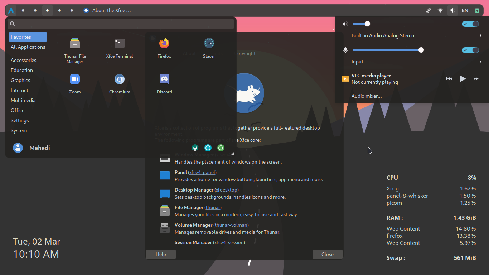

# My dotfiles

Another rice from me

Though I use XFCE, but I think this rice (theme actually) will be better for tiling WMs , such as BSPWM

# A short description:

Compositor: Picom-ibhagwan fork

Widget: Conky > Clock and CPU/RAM monitor

Theme: It's actually based on Qogir-dark. i.e. I only changed the colors and removed the android-like button clicking animation.

# For smoother experience

I recommend using gtk3-nocsd package. I've assigned different key bindings for moving and resizing the active window (mod + touchpad and mod+r respectively). This theme is for actually myself, and I'm kind-a good with it lol. Imporvement requests are always appriciated ;)

# Screenshots

# P.S.
I'm thinking maybeee I'd make my own theme which will look a lot like it, but better. Here are the unsolved issues of my modified version of Qogir-dark
1) Toggle buttons suck
2) Disabled entry fields have so ugly semi-transparent blue-ish background
3) No proper window decorations, in fact, no window decorations at all. My mod uses an empty xfwm theme. So, whenever two windows overlap each other, it's nearly impossible to identify their border
