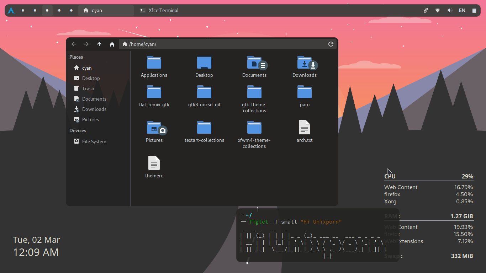

# dotfiles_v2

Another rice from me

Though I use XFCE, but I think this rice (theme actually) will be better for tiling WMs , such as BSPWM

# A short description:

Compositor: Picom-ibhagwan fork

Widget: Conky > Clock and CPU/RAM monitor

# Screenshot

